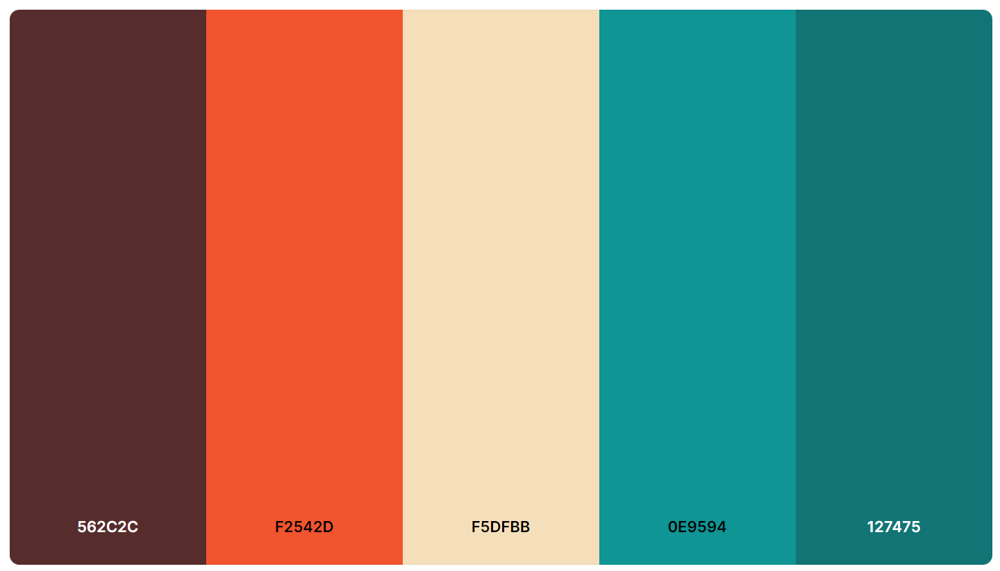

# ZaverecnaPraceWBA - Osobní portfolio

## Popis

Mým cílem v rámci závěrečné práce WBA je vytvořit osobní webové portfolio, které bude představovat mé projekty a dovednosti v oblasti IT a zároveň mě jako člověka. Chci, aby tato stránka ukázala můj zájem o technologie a udělala co největší dojem. Mým úmyslem je prezentovat sebe sama jako kreativního a cílevědomého jedince s vášní pro IT, programování a mnoho dalších zajímavých věcí. Chci, aby moje portfolio oslovilo podobně zaměřené lidi a možná mi i otevřelo dveře k budoucím příležitostem v oblastech, které mě zajímají. Budu se snažit, aby prezentace mého portfolia byla profesionální, ale zároveň osobní a autentická, aby skutečně odrážela mou osobnost a úsilí, které do svých projektů vkládám. 

## Nápad a inspirace 

Mojí halvní inspirací byli tyto dvě stránky:
- https://www.awwwards.com/sites/submission-6364dde2a2f86187118961
- https://www.awwwards.com/sites/welcome-to-planet-experience

Chtěl bych na své stránce udělat něco podobného. Využít knihovnu three.js a obzvláštnit stránku 3D modely. Zároveň chci udělet stránku trochu interaktivní a přidat nějaké easter eggy / mini hry. Na stránce chci hlavně představit svůj blockchain projekt a své 3D modely.

### Barvy

Na stránce se budu snažit používat hlavně barvy z této palety barev. Věřím, že stránka poté bude vypadat lépe. (Paletu barev možná v průběhu změní, když se mi nebude líbit)

https://coolors.co/palette/562c2c-f2542d-f5dfbb-0e9594-127475