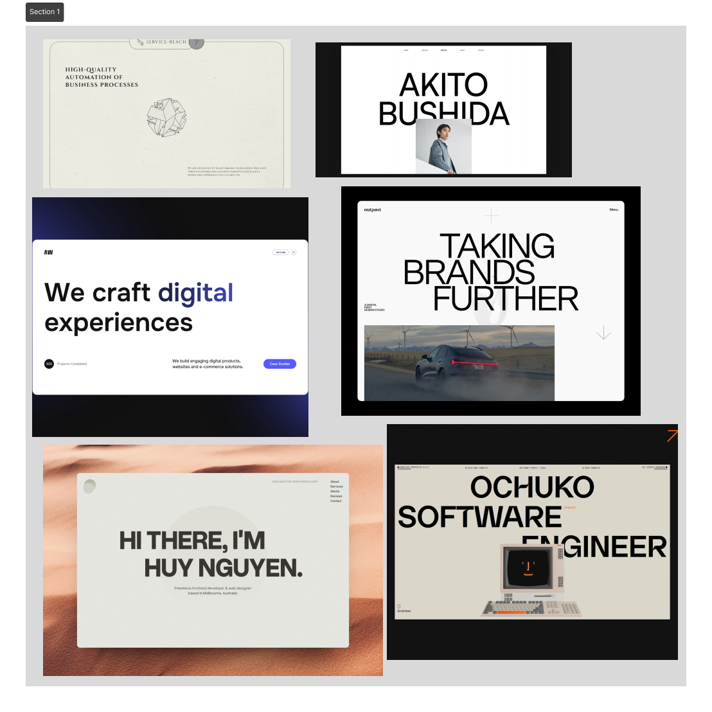
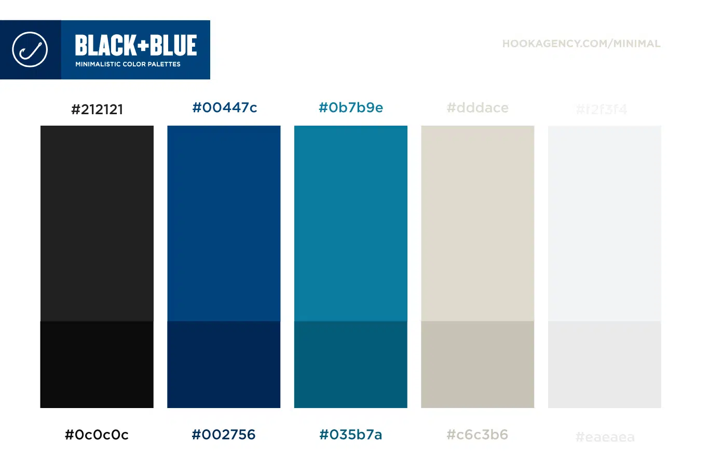

# ZaverecnaPraceWBA - Osobní portfolio

## Popis

Mým cílem v rámci závěrečné práce WBA je vytvořit osobní webové portfolio, které bude představovat mé projekty a dovednosti v oblasti IT a zároveň mě jako člověka. Chci, aby tato stránka ukázala můj zájem o technologie a udělala co největší dojem. Mým úmyslem je prezentovat sebe sama jako kreativního a cílevědomého jedince s vášní pro IT, programování a mnoho dalších zajímavých věcí. Chci, aby moje portfolio oslovilo podobně zaměřené lidi a možná mi i otevřelo dveře k budoucím příležitostem v oblastech, které mě zajímají. Chci při vytváření portfolia vyzkoušet co nejvíc technologií co jsem ještě nepoužil a naučit se něco nového. Budu se snažit, aby prezentace mého portfolia byla profesionální, ale zároveň osobní a autentická, aby skutečně odrážela mou osobnost a úsilí, které do svých projektů vkládám. 

### Jazyk

Stránka bude v angličtině, ale bude zde možnost přeložení jazyka do češtiny.
(Přesměrování na stránku s českou variantou)

## Nápad a inspirace 

Mojí hlavní inspirací bylo toto video a stránky na awwwards.com:

video:
- https://www.youtube.com/watch?v=83j3Z4heXH0&list=WL&index=2&t=50s

stránky:
- https://www.awwwards.com/sites/hydrogen-oxygen
- https://www.awwwards.com/sites/dsrv
- https://www.awwwards.com/sites/soul-aether
- https://www.awwwards.com/sites/vivatech-2022
- https://www.awwwards.com/sites/dr-pepper
- https://www.awwwards.com/sites/lucky-beard-global-1
- https://www.awwwards.com/sites/welcome-to-planet-experience

Chtěl bych na své stránce udělat něco, kde využiji knihovnu three.js a obzvláštnit stránku 3D modely. Zároveň chci udělet stránku trochu interaktivní a přidat nějaké easter eggy / mini hry. Na stránce chci hlavně představit svůj blockchain projekt a své 3D modely.

### MoodBoard

### Font

Na stránce použiji font - Raleway

https://fonts.google.com/specimen/Roboto+Slab?preview.text=ahoj%20j%C3%A1%20jsem%20Pavel%20Oly%C5%A1ar&query=roboto&subset=cyrillic-ext&noto.lang=bg_Cyrl

### Barvy

Na stránce se budu snažit používat hlavně barvy z této palety barev. Věřím, že stránka poté bude vypadat lépe.

- --platinum: #ccdbdcff;
- --non-photo-blue: #80ced7ff;
- --tiffany-blue: #63c7b2ff;
- --chinese-violet: #8e6c88ff;
- --gunmetal: #263d42ff;

https://coolors.co/palette/562c2c-f2542d-f5dfbb-0e9594-127475

## Technologie k vytvoření stránky

- Html, CSS, JS
- Three.js + Blender 3D

## Struktura

1. ÚVODNÍ STRÁNKA (Home)
    - úvod
    - hlavní 3d model
    - hlavní informace

2. INFO (About)
    - základní informace

3. STRÁNKA S BLOCKCHAIN PROJEKTEM (Blockchain)
    - ukázka mého blockchain projektu (interaktivní)
    - informace o projektu
    - github odkaz

4. STRÁNKA S JEDNODUCHOU ONLINE MINI HROU (Game)
    - hra na způsob mobilní hry Monument Valley

5. STRÁNKA S 3D MODELY (3D)
    - ukázka 3d modelů

6. KONTAKTY (Contacts)
    - formulář
    - odkazy